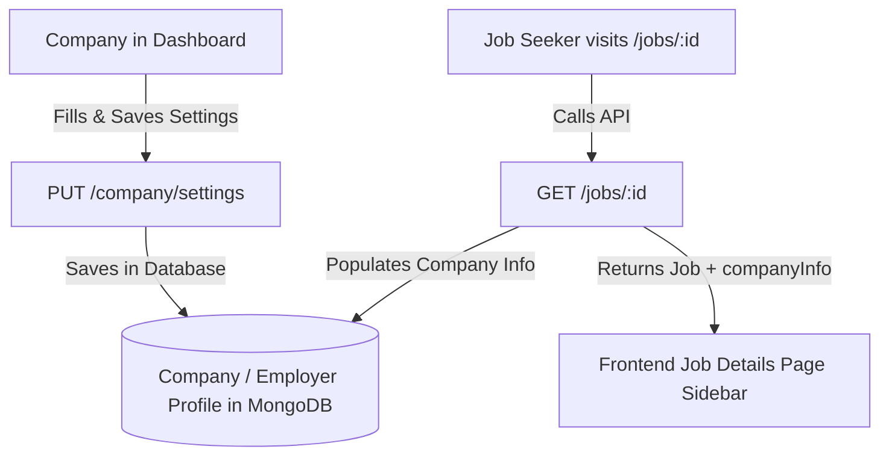

# Backend Guide: Company Profile Fields & Job Details Integration

## 1. Overview & Findings
In this frontend application:
- **All required company fields are already available** in the **Company Dashboard > Company Settings** (`/company/settings`).
- Companies can enter and save their **Company Name, Industry, Company Size, Website, Founded Year, About Company, Location (City, State, Country), Contacts, and Social Links**.
- The frontend sends this data to the backend via `PUT /company/settings` (or `PUT /employer/settings`).

The missing information on the **Job Details Page** (`/jobs/:id`) occurs because the backend's `GET /jobs/:id` endpoint does not **link/populate** the company's profile information into the `Job` response object as `companyInfo`.

---

## 2. How the Flow Works



---

## 3. Database Schemas (Mongoose)

### 3.1 Company / Employer Profile Schema (`models/CompanyProfile.js` or `models/Employer.js`)
```javascript
import mongoose from 'mongoose';

const companyProfileSchema = new mongoose.Schema(
  {
    userId: {
      type: mongoose.Schema.Types.ObjectId,
      ref: 'User',
      required: true,
      unique: true,
    },
    companyName: { type: String, required: true },
    industry: { type: String, default: '' },
    companySize: { type: String, default: '' }, // e.g. "50-100 employees"
    companyType: { type: String, default: '' }, // e.g. "Private", "Public"
    website: { type: String, default: '' },
    founded: { type: String, default: '' }, // e.g. "2015"
    about: { type: String, default: '' },
    logoUrl: { type: String, default: '' },
    location: {
      city: { type: String, default: '' },
      state: { type: String, default: '' },
      country: { type: String, default: '' },
    },
    contact: {
      phone: { type: String, default: '' },
      hrEmail: { type: String, default: '' },
      supportEmail: { type: String, default: '' },
    },
    social: {
      linkedin: { type: String, default: '' },
      twitter: { type: String, default: '' },
      facebook: { type: String, default: '' },
      instagram: { type: String, default: '' },
      github: { type: String, default: '' },
    },
  },
  { timestamps: true }
);

export const CompanyProfile = mongoose.model('CompanyProfile', companyProfileSchema);
```

---

### 3.2 Job Schema (`models/Job.js`)
```javascript
import mongoose from 'mongoose';

const jobSchema = new mongoose.Schema(
  {
    title: { type: String, required: true },
    employerId: {
      type: mongoose.Schema.Types.ObjectId,
      ref: 'User', // or 'CompanyProfile'
      required: true,
    },
    company: { type: String, required: true }, // Cached name for quick lookup
    location: { type: String, required: true },
    jobType: { type: String, default: 'full-time' },
    workMode: { type: String, default: 'on-site' },
    category: { type: String, default: '' },
    experienceLevel: { type: String, default: 'Entry Level' },
    salaryMin: { type: Number, default: 0 },
    salaryMax: { type: Number, default: 0 },
    salaryPeriod: { type: String, default: 'yearly' },
    description: { type: String, required: true },
    requirements: { type: String, default: '' },
    benefits: { type: String, default: '' },
    skills: [{ type: String }],
    vacancies: { type: Number, default: 1 },
    deadline: { type: Date },
    status: {
      type: String,
      enum: ['active', 'draft', 'closed'],
      default: 'active',
    },
    applicantsCount: { type: Number, default: 0 },
  },
  { timestamps: true }
);

export const Job = mongoose.model('Job', jobSchema);
```

---

## 4. Backend Controllers & API Endpoints

### 4.1 Update Company Settings (`PUT /company/settings`)
When the company saves their profile in **Company Settings**, this endpoint is called:

```javascript
import { CompanyProfile } from '../models/CompanyProfile.js';

export const updateCompanySettings = async (req, res) => {
  try {
    const userId = req.user.id; // Logged in employer's ID from auth middleware
    const {
      companyName,
      industry,
      companySize,
      companyType,
      website,
      founded,
      about,
      location,
      contact,
      social,
    } = req.body;

    const updatedProfile = await CompanyProfile.findOneAndUpdate(
      { userId },
      {
        companyName,
        industry,
        companySize,
        companyType,
        website,
        founded,
        about,
        location,
        contact,
        social,
      },
      { new: true, upsert: true }
    );

    return res.status(200).json({
      success: true,
      message: 'Company settings updated successfully',
      data: updatedProfile,
    });
  } catch (error) {
    return res.status(500).json({
      success: false,
      message: error.message || 'Failed to update company settings',
    });
  }
};
```

---

### 4.2 Get Job Details with Company Info (`GET /jobs/:id`)
When any user opens the job details page (`/jobs/:jobId`), populate or fetch the company profile:

```javascript
import { Job } from '../models/Job.js';
import { CompanyProfile } from '../models/CompanyProfile.js';

export const getJobDetails = async (req, res) => {
  try {
    const { id } = req.params;

    const job = await Job.findById(id);
    if (!job) {
      return res.status(404).json({
        success: false,
        message: 'Job not found',
      });
    }

    // Fetch the company profile of the employer who posted the job
    const companyProfile = await CompanyProfile.findOne({ userId: job.employerId });

    // Format location string
    const locParts = [
      companyProfile?.location?.city,
      companyProfile?.location?.state,
      companyProfile?.location?.country,
    ].filter(Boolean);
    const companyLocation = locParts.length > 0 ? locParts.join(', ') : job.location;

    // Build the formatted response
    const jobData = {
      ...job.toObject(),
      id: job._id,
      company: companyProfile?.companyName || job.company,
      companyInfo: {
        industry: companyProfile?.industry || 'Technology & Software',
        about: companyProfile?.about || 'No company bio provided yet.',
        website: companyProfile?.website || '',
        location: companyLocation,
        employees: companyProfile?.companySize || '1-50 employees',
        founded: companyProfile?.founded ? `Founded in ${companyProfile.founded}` : '',
        logoUrl: companyProfile?.logoUrl || '',
      },
    };

    return res.status(200).json({
      success: true,
      data: jobData,
    });
  } catch (error) {
    return res.status(500).json({
      success: false,
      message: error.message || 'Error fetching job details',
    });
  }
};
```

---

## 5. Summary of Actions
| Location | Status | Action Needed |
| :--- | :--- | :--- |
| **Frontend: Company Dashboard** | ✅ **Already Implemented** | Companies can edit & save all fields in **Company Settings** (`/company/settings`). |
| **Frontend: Job Details View** | ✅ **Already Protected** | Safely handles missing fields and displays available fields with proper icons. |
| **Backend: `PUT /company/settings`** | ⚠️ **Backend Action** | Ensure Company Settings are saved to `CompanyProfile` collection in MongoDB. |
| **Backend: `GET /jobs/:id`** | ⚠️ **Backend Action** | Populate / query `CompanyProfile` using `employerId` and return `companyInfo` object in the response. |
